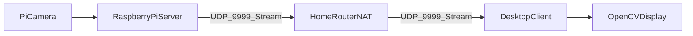
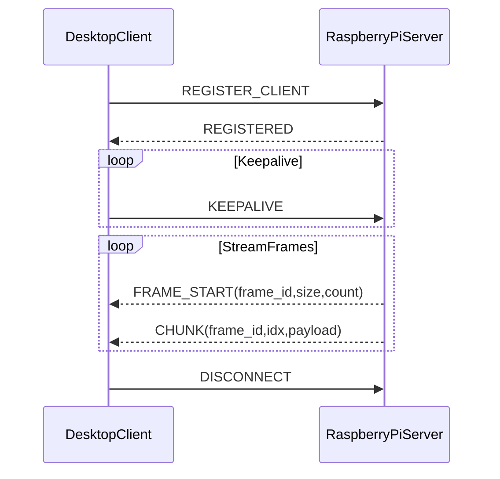

# arc42 Architecture Documentation

This document follows the arc42 template for software architecture
documentation. Fill in or update sections as the system evolves.

Template reference: https://arc42.org/

## 1. Introduction and Goals

### 1.1 Requirements Overview
- Primary goal: Receive and display low-latency UDP video streams from a
  Raspberry Pi camera server.
- Secondary goals: NAT-friendly connectivity, cross-platform client,
  minimal dependencies.

### 1.2 Quality Goals
- Low latency and fast startup
- Reliable frame reassembly under packet loss
- Operational simplicity (single socket, simple deployment)
- Debuggability via logs and runtime stats

### 1.3 Stakeholders
- End users: View live camera stream on desktop
- Developers: Maintain and extend protocol and client features
- Operators: Configure network, port forwarding, firewall rules

## 2. Architecture Constraints
- UDP transport (no TCP)
- Chunked packets (avoid IP fragmentation)
- Python client implementation with OpenCV
- NAT-friendly single-socket registration and receive

## 3. System Scope and Context

### 3.1 Business Context
- Camera stream source: Raspberry Pi + Pi Camera (server side)
- Client: Desktop/laptop receiving and displaying video

#### Context Diagram

### 3.2 Technical Context
- UDP packets on port 9999
- JPEG-compressed frames serialized with pickle
- Custom frame chunking protocol

## 4. Solution Strategy
- Use a single UDP socket for registration, keepalive, and frame reception
- Always chunk frames into small packets to avoid fragmentation
- Reassemble frames client-side and decode to images via OpenCV
- Overlay runtime metrics for observability

## 5. Building Block View

### 5.1 Level 1 (System Overview)
- UDP client (main receiver)
- Display subsystem (window, overlays, controls)
- Protocol parser and frame reassembly

### 5.2 Level 2 (Key Components)
- Registration and keepalive handler
- Frame start and chunk parser
- Frame buffer manager (pending frames, chunk tracking)
- Decoder (pickle -> JPEG -> image)
- Display UI (OpenCV window)

## 6. Runtime View

### 6.1 Client-Server Mode
1. Client sends REGISTER_CLIENT to server
2. Server replies REGISTERED
3. Client sends periodic KEEPALIVE
4. Server streams FRAME_START and CHUNK packets
5. Client reassembles, decodes, and displays frames

#### Runtime Sequence (Client-Server Mode)

### 6.2 Broadcast Mode
1. Client listens on UDP 9999
2. Receives broadcast frames
3. Decompresses and displays

## 7. Deployment View
- Client runs on macOS, Linux, or Windows with Python 3.x
- Dependencies: OpenCV, NumPy
- UDP port 9999 open on client and server
- Router port forwarding required for WAN use

## 8. Crosscutting Concepts
- Serialization: pickle for JPEG buffers
- Compression: JPEG per frame
- Networking: UDP, chunk reassembly, NAT keepalive
- Observability: runtime stats and logs

## 9. Architecture Decisions

Use ADR entries for significant changes:

- ADR-001: Always-chunked UDP to avoid IP fragmentation
- ADR-002: Single-socket NAT-friendly registration and receive
- ADR-003: Pickle serialization for JPEG buffers

## 10. Quality Requirements

### 10.1 Performance
- Target FPS: 25-30 on LAN; lower on WAN
- Low latency reception and display

### 10.2 Reliability
- Drop incomplete frames on packet loss
- Tolerate duplicate chunks

### 10.3 Security
- Pickle deserialization is risky; only use with trusted servers

## 11. Risks and Technical Debt
- Pickle dependence limits non-Python clients
- No resend or FEC for lost packets
- JPEG per frame is bandwidth-heavy

## 12. Glossary
- Frame: One JPEG image
- Chunk: A fragment of a frame payload
- NAT: Network Address Translation
