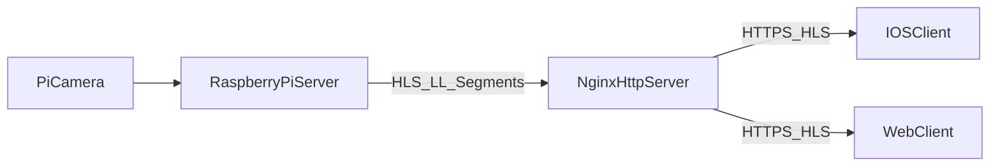
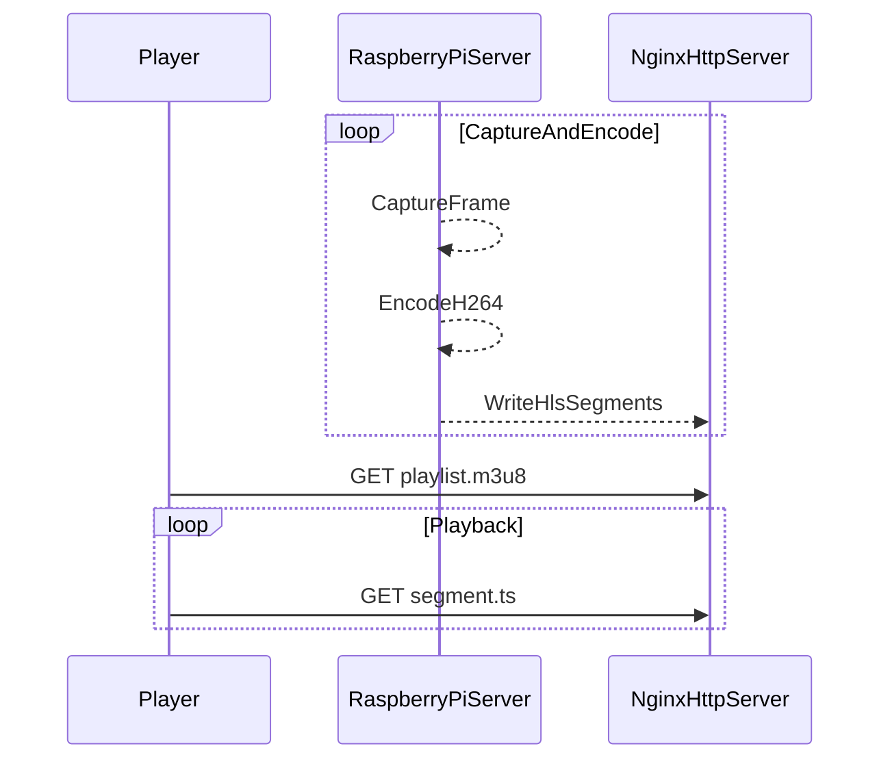

# arc42 Architecture Documentation

This document follows the arc42 template for software architecture
documentation. Fill in or update sections as the system evolves.

Template reference: https://arc42.org/

## 1. Introduction and Goals

### 1.1 Requirements Overview
- Primary goal: Capture and stream video from Raspberry Pi to iOS and web clients
  using standard protocols.
- Secondary goals: Low latency (LL-HLS), cross-platform playback, simple ops.

### 1.2 Quality Goals
- Low latency for HLS (LL-HLS)
- Stable playback on iOS and web clients
- Operational simplicity (single pipeline, simple deployment)
- Debuggability via logs and runtime stats

### 1.3 Stakeholders
- End users: View live camera stream on iOS and web
- Developers: Maintain and extend capture/encode/streaming pipeline
- Operators: Configure network, HTTP server, and streaming options

## 2. Architecture Constraints
- Raspberry Pi 5 + Pi Camera v2.1 with Picamera2
- H.264 encoding with hardware acceleration where available
- HLS delivery over HTTP (start with Nginx)
- Single pipeline architecture (Option A)

## 3. System Scope and Context

### 3.1 Business Context
- Camera stream source: Raspberry Pi + Pi Camera (server side)
- Clients: iOS app and web client using native playback stacks

#### Context Diagram

### 3.2 Technical Context
- H.264 encoded video
- LL-HLS segments and playlists over HTTP(S)
- Nginx serving HLS artifacts

## 4. Solution Strategy
- Single capture/encode pipeline on the Pi (Option A)
- LL-HLS output for iOS and web playback
- Nginx serves playlists and segments over HTTP(S)
- Capture metrics for FPS/bitrate and streaming health

## 5. Building Block View

### 5.1 Level 1 (System Overview)
- Capture/encode pipeline
- HLS packager
- HTTP server for segment delivery

### 5.2 Level 2 (Key Components)
- Picamera2 capture
- H.264 encoder (HW accelerated)
- HLS segmenter/playlist writer
- Nginx static file server
- Metrics/logging

## 6. Runtime View

### 6.1 Client-Server Mode
1. Pi captures frames and encodes to H.264
2. HLS segmenter writes LL-HLS segments and playlist
3. Nginx serves playlist and segments
4. iOS/web clients request and play stream

#### Runtime Sequence (HLS)

### 6.2 Future: WebRTC Mode
1. Pi captures and encodes frames
2. WebRTC pipeline streams to browser
3. Browser plays stream with low latency

## 7. Deployment View
- Pi runs capture/encode and HLS segmenter
- Nginx serves HLS over HTTP(S)
- Clients use AVPlayer (iOS) and browser playback

## 8. Crosscutting Concepts
- Compression: H.264 encoding
- Packaging: LL-HLS segments and playlists
- Delivery: HTTP(S) via Nginx
- Observability: runtime stats and logs

## 9. Architecture Decisions

Use ADR entries for significant changes:

- ADR-001: Use LL-HLS for iOS-friendly playback
- ADR-002: Single pipeline architecture (Option A)
- ADR-003: Nginx as initial HLS HTTP server

## 10. Quality Requirements

### 10.1 Performance
- Target FPS: 25-30 on LAN; lower on WAN
- LL-HLS target latency: 2-4 s end-to-end

### 10.2 Reliability
- Retry failed segment downloads and resume playback after reconnect
- Handle incomplete or stale HLS segments by reloading the playlist

### 10.3 Security
- HTTPS/TLS for HLS delivery when exposed

## 11. Risks and Technical Debt
- HLS latency higher than WebRTC for real-time use
- Segmenter/HTTP tuning needed for stable LL-HLS

## 12. Glossary
- Segment: One HLS media chunk
- Playlist: HLS manifest file
- NAT: Network Address Translation
